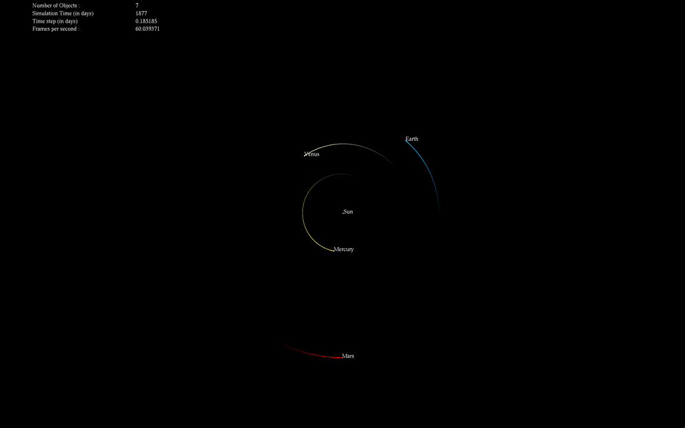
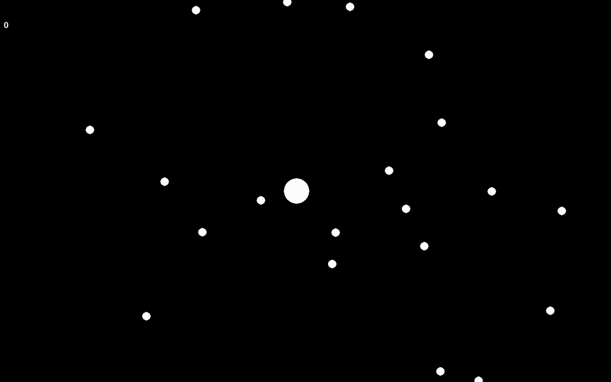
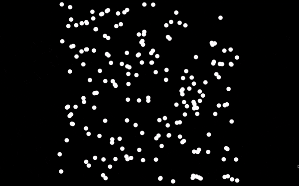
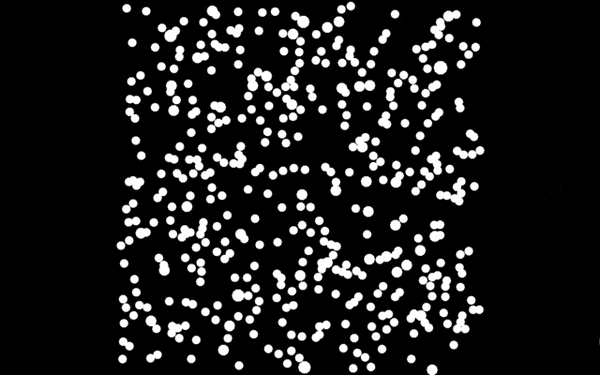
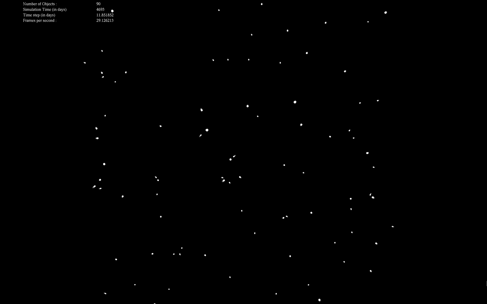

# Gravity Simulation

Python and C++ simulation of gravity, using Runge-Kutta integration methods.

  

I started by building a small python implementation with Euler integration, but realized quickly it would not work very well, even with small amounts of particles (especially using pygame for display):

  

I hence used RK4, and switched to C++ to improve the speed. It was a lot better, and looked already quite fun, even without collisions handling.

  

I then implemented particle fusion, as shown below.

  

Added a small lag to display the previous positions, particle and fps count.

  

The final step was too load data from a file to be able to look at the solar system for instance.

  

The next evolution was to use a tree to sort the particles in space and turn this naive n2 approach into a Barnes-Hut simulation.
Here is the first version of the quad tree, implemented on top of the python code. 

  

And this shows which quadrants are used indeed to compute the acceleration on the red particle.

  

Although the performance was better than with the previous method, it is still not really exploitable with pyhton. I hence implemented it in C++, and could simulate several thousands of particles, as shown in the following image:

  

